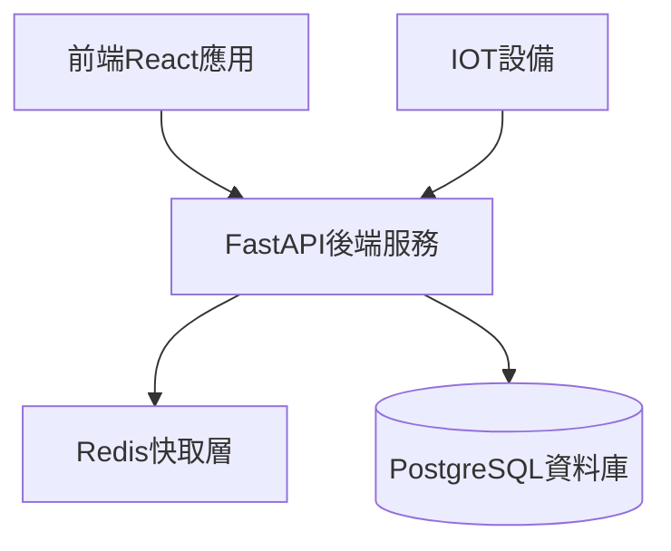
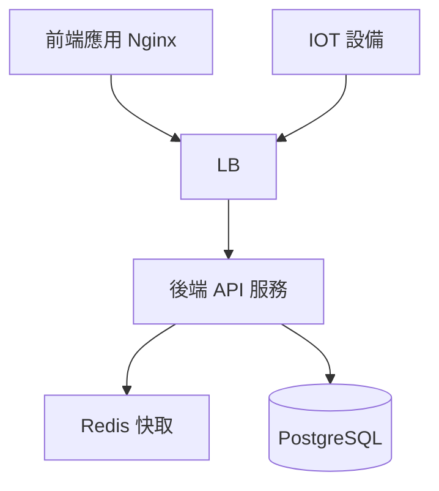

# **專案需求文件**

## **專案名稱：運動中心即時人流總覽後台系統**

## **1. 系統概述**

### **1.1 系統目標**

開發一個高效能、可擴展的後台API系統，為運動中心即時人流監控儀表板提供穩定的資料服務。採用微服務架構設計，實現前後端完全分離，提供RESTful API與WebSocket服務。

### **1.2 技術架構**

#### **1.2.1 主要技術棧**

- **後端框架**：FastAPI
- **資料庫**：PostgreSQL
- **ORM**：SQLAlchemy
- **API文檔**：OpenAPI (Swagger UI)
- **快取系統**：Redis
- **部署容器**：Docker & Docker Compose
- **API安全**：JWT Token 認證

#### **1.2.2 系統架構圖**



## **2. 資料庫設計**

### **2.1 資料表結構**

#### **2.1.1 運動中心資訊表 (sport_centers)**

```sql
CREATE TABLE sport_centers (
    id UUID PRIMARY KEY DEFAULT gen_random_uuid(),
    name VARCHAR(100) NOT NULL,
    address VARCHAR(255) NOT NULL,
    location JSON NOT NULL, -- {"lat": 25.0330, "lng": 121.5654, "place_id": "ChIJXXXXXXXXXXXXXXXXXXX"}
    formatted_address VARCHAR(255) NOT NULL, -- Google Maps 格式化地址
    max_capacity JSON NOT NULL, -- {"gym": 100, "pool": 50}
    created_at TIMESTAMP WITH TIME ZONE DEFAULT CURRENT_TIMESTAMP,
    updated_at TIMESTAMP WITH TIME ZONE DEFAULT CURRENT_TIMESTAMP,
    UNIQUE(name)
);

-- 建立地理位置索引以支援位置查詢
CREATE INDEX idx_sport_centers_location ON sport_centers USING GIN ((location->>'lat'), (location->>'lng'));
```

#### **2.1.2 即時人流資料表 (real_time_flows)**

```sql
CREATE TABLE real_time_flows (
    id UUID PRIMARY KEY DEFAULT gen_random_uuid(),
    center_id UUID NOT NULL REFERENCES sport_centers(id),
    area_type VARCHAR(20) NOT NULL, -- 'gym' or 'pool'
    current_count INTEGER NOT NULL,
    timestamp TIMESTAMP WITH TIME ZONE DEFAULT CURRENT_TIMESTAMP,
    CHECK (area_type IN ('gym', 'pool'))
);

CREATE INDEX idx_real_time_flows_center_timestamp
ON real_time_flows(center_id, timestamp);
```

#### **2.1.3 歷史統計資料表 (historical_stats)**

```sql
CREATE TABLE historical_stats (
    id UUID PRIMARY KEY DEFAULT gen_random_uuid(),
    center_id UUID NOT NULL REFERENCES sport_centers(id),
    area_type VARCHAR(20) NOT NULL,
    avg_count FLOAT NOT NULL,
    max_count INTEGER NOT NULL,
    date DATE NOT NULL,
    created_at TIMESTAMP WITH TIME ZONE DEFAULT CURRENT_TIMESTAMP,
    UNIQUE(center_id, area_type, date)
);
```

## **3. API設計**

### **3.1 RESTful API端點**

#### **3.1.1 運動中心管理**

```typescript
// 獲取所有運動中心列表
GET /api/v1/centers
Response: {
    centers: [{
        id: string,
        name: string,
        address: string,
        formatted_address: string,
        location: {
            lat: number,
            lng: number,
            place_id: string
        },
        max_capacity: {
            gym: number,
            pool: number
        }
    }]
}

// 獲取特定運動中心詳情
GET /api/v1/centers/{center_id}
Response: {
    id: string,
    name: string,
    address: string,
    formatted_address: string,
    location: {
        lat: number,
        lng: number,
        place_id: string
    },
    max_capacity: {
        gym: number,
        pool: number
    },
    operation_hours: {
        weekday: { open: string, close: string },
        weekend: { open: string, close: string }
    },
    current_stats: {
        gym: {
            current_count: number,
            percentage: number
        },
        pool: {
            current_count: number,
            percentage: number
        }
    }
}

// 搜尋附近的運動中心
GET /api/v1/centers/nearby
Query Parameters: {
    lat: number,        // 當前位置緯度
    lng: number,        // 當前位置經度
    radius?: number     // 搜尋半徑（公尺），預設 5000
}
Response: {
    centers: [{
        id: string,
        name: string,
        formatted_address: string,
        location: {
            lat: number,
            lng: number,
            place_id: string
        },
        distance: number,  // 與當前位置的距離（公尺）
        current_stats: {
            gym: {
                current_count: number,
                percentage: number
            },
            pool: {
                current_count: number,
                percentage: number
            }
        }
    }]
}
```

#### **3.1.2 即時人流數據**

```typescript
// 獲取即時人流數據
GET /api/v1/flows/current
Query Parameters: {
    center_id?: string  // 可選，若不提供則返回所有中心
}
Response: {
    timestamp: string,
    centers: [{
        id: string,
        name: string,
        gym: {
            current_count: number,
            max_capacity: number,
            percentage: number
        },
        pool: {
            current_count: number,
            max_capacity: number,
            percentage: number
        }
    }]
}

// 更新即時人流數據 (IoT設備使用)
POST /api/v1/flows
Request Body: {
    center_id: string,
    area_type: "gym" | "pool",
    count: number
}
Response: {
    success: boolean,
    message: string
}
```

#### **3.1.3 統計數據**

```typescript
// 獲取趨勢數據
GET /api/v1/stats/trend
Query Parameters: {
    center_id: string,
    area_type: "gym" | "pool",
    time_range: "daily" | "weekly" | "monthly",
    start_date: string,  // YYYY-MM-DD
    end_date: string     // YYYY-MM-DD
}
Response: {
    center_id: string,
    area_type: string,
    data: [{
        timestamp: string,
        count: number,
        percentage: number
    }]
}
```

### **3.2 WebSocket API**

```typescript
// 即時更新WebSocket
WS /ws/flows/{center_id}
Message Format: {
    type: "update",
    data: {
        center_id: string,
        timestamp: string,
        gym: {
            current_count: number,
            percentage: number
        },
        pool: {
            current_count: number,
            percentage: number
        }
    }
}
```

### **3.3 錯誤處理與回應格式**

- 全域統一錯誤結構
  - HTTP 狀態碼 (status)
  - 錯誤代碼 (code)
  - 可讀訊息 (message)
  - 例外詳細 (details, optional)
- 示例：

  ```json
  {
    "status": 400,
    "code": "InvalidParameter",
    "message": "area_type 必須為 'gym' 或 'pool'",
    "details": { "field": "area_type" }
  }
  ```

### **3.4 身份驗證與授權**

- 使用 JWT Bearer Token
- 登入端點：
  - POST /api/v1/auth/login
  - Request: `{ "username": string, "password": string }`
  - Response: `{ "access_token": string, "expires_in": number }`
- 受保護資源需在 Header `Authorization: Bearer <token>`
- 權限分級 (Role-Based Access Control)

### **3.5 健康檢查與服務狀態**

- GET /health
  - Response: `{ "status": "ok", "database": "connected", "cache": "ok" }`
- 用於容器編排健康檢查

### **3.6 請求驗證與輸入模型**

- 使用 Pydantic Schema 驗證所有輸入
- 詳細定義 DTO/Model
- 自動生成 OpenAPI 文件

## **4. 系統功能實現**

### **4.1 快取策略**

- 使用Redis快取運動中心基本資訊，有效期24小時
- 即時人流數據快取5分鐘
- 實作緩存預熱機制，系統啟動時預載常用數據

### **4.2 資料聚合與統計**

- 使用定時任務每小時計算統計數據
- 實作資料滾動統計，保持資料時效性
- 使用materialized view優化查詢效能

### **4.3 效能優化**

- 實作數據分頁機制
- 使用異步處理大量數據請求
- 實作請求限流保護

## **5. 部署架構**

### **5.1 系統部署架構**



### **5.2 Docker配置**

```yaml
version: '3.8'

services:
  api:
    build:
      context: .
      dockerfile: Dockerfile
    environment:
      - DATABASE_URL=postgresql://user:password@db:5432/cscflow
      - REDIS_URL=redis://redis:6379
      - JWT_SECRET=your-secret-key
      - CORS_ORIGINS=http://your-frontend-domain.com
    ports:
      - "8000:8000"
    deploy:
      replicas: 2
      update_config:
        parallelism: 1
        delay: 10s
      restart_policy:
        condition: on-failure
    healthcheck:
      test: ["CMD", "curl", "-f", "http://localhost:8000/health"]
      interval: 30s
      timeout: 10s
      retries: 3
    depends_on:
      - db
      - redis

  db:
    image: postgres:15-alpine
    environment:
      - POSTGRES_USER=user
      - POSTGRES_PASSWORD=password
      - POSTGRES_DB=cscflow
    volumes:
      - postgres_data:/var/lib/postgresql/data
    healthcheck:
      test: ["CMD-SHELL", "pg_isready -U user -d cscflow"]
      interval: 30s
      timeout: 5s
      retries: 3

  redis:
    image: redis:7-alpine
    volumes:
      - redis_data:/data
    healthcheck:
      test: ["CMD", "redis-cli", "ping"]
      interval: 30s
      timeout: 5s
      retries: 3

volumes:
  postgres_data: '/Users/sacahan/Documents/workspace/CSCFlow/docker_mount/postgres'
  redis_data: '/Users/sacahan/Documents/workspace/CSCFlow/docker_mount/redis'
```

## **6. 測試策略**

### **6.1 單元測試**

- 使用pytest進行單元測試
- 實作測試資料工廠
- 使用mock模擬外部依賴

### **6.2 整合測試**

- 使用TestClient測試API端點
- 實作端到端測試場景
- 使用Docker Compose建立測試環境

### **6.3 效能測試**

- 使用locust進行負載測試
- 建立效能基準指標
- 定期進行效能監控

## **7. 安全性考量**

- 實作API認證機制
- 加入請求驗證
- 實作資料加密
- 設置CORS策略
