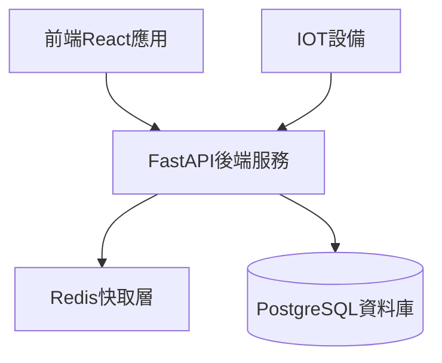
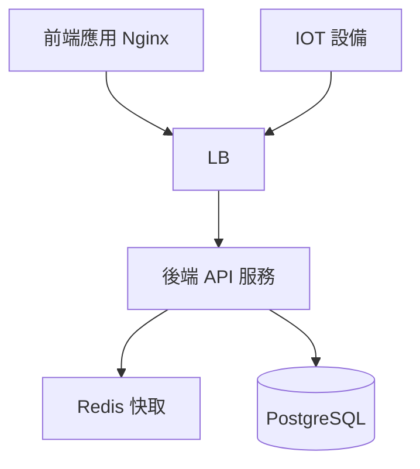

# **專案需求文件**

## **專案名稱：運動中心即時人流總覽後台系統**

## **1. 系統概述**

### **1.1 系統目標**

開發一個高效能、可擴展的後台API系統，為運動中心即時人流監控儀表板提供穩定的資料服務。採用微服務架構設計，實現前後端完全分離，提供RESTful API與WebSocket服務。

### **1.2 技術架構**

#### **1.2.1 主要技術棧**

- **後端框架**：FastAPI
- **資料庫**：PostgreSQL
- **ORM**：SQLAlchemy
- **API文檔**：OpenAPI (Swagger UI)
- **快取系統**：Redis
- **部署容器**：Docker & Docker Compose
- **API安全**：JWT Token 認證

#### **1.2.2 系統架構圖**



## **2. 資料庫設計**

### **2.1 資料表結構**

#### **2.1.1 即時人流資料表 (real_time_flows)**

```sql
CREATE TABLE real_time_flows (
    id UUID PRIMARY KEY DEFAULT gen_random_uuid(),
    zip_code CHAR(3) NOT NULL, -- 使用運動中心所在郵遞區號作為索引
    area_type VARCHAR(5) NOT NULL, -- 'gym' or 'pool'
    current_count INTEGER NOT NULL,
    timestamp TIMESTAMP WITH TIME ZONE DEFAULT CURRENT_TIMESTAMP,
    CHECK (area_type IN ('gym', 'pool'))
);

CREATE INDEX idx_real_time_flows_center_timestamp
ON real_time_flows(center_id, timestamp);
```

#### **2.1.2 歷史統計資料表 (historical_stats)**

```sql
CREATE TABLE historical_stats (
    id UUID PRIMARY KEY DEFAULT gen_random_uuid(),
    zip_code CHAR(3) NOT NULL, -- 使用運動中心所在郵遞區號作為索引
    area_type VARCHAR(5) NOT NULL, -- 'gym' 或 'pool'
    stats_type VARCHAR(10) NOT NULL, -- 'daily', 'weekly', 'monthly'
    total_count INTEGER NOT NULL, -- 累積人數
    avg_count FLOAT NOT NULL, -- 平均人數
    max_count INTEGER NOT NULL, -- 最大人數
    min_count INTEGER NOT NULL, -- 最小人數
    start_date DATE NOT NULL, -- 統計開始日期
    end_date DATE NOT NULL, -- 統計結束日期
    created_at TIMESTAMP WITH TIME ZONE DEFAULT CURRENT_TIMESTAMP,
    updated_at TIMESTAMP WITH TIME ZONE DEFAULT CURRENT_TIMESTAMP,
    UNIQUE(zip_code, area_type, stats_type, start_date),
    CHECK (area_type IN ('gym', 'pool')),
    CHECK (stats_type IN ('daily', 'weekly', 'monthly'))
);

-- 建立複合索引以提升查詢效能
CREATE INDEX idx_historical_stats_lookup
ON historical_stats(zip_code, area_type, stats_type, start_date);
```

### **2.3 運動中心配置**

### **2.3.1 配置文件結構**

運動中心的基本資訊、設施狀態及數據收集方式由以下兩個 YAML 文件提供：

#### **web_scrapers.yaml**

```yaml
version: "1.0"
last_updated: "2024-07-29"

global_settings: # 全域設定
    request_timeout: 30 # 運動中心API請求超時時間
    retry_attempts: 3 # 運動中心API重試次數
    retry_delay: 5 # 運動中心API重試延遲時間

centers:
    taipei_beitou: # 運動中心Label
        basic_info: # 運動中心基本資訊
            name: "台北市北投運動中心" # 運動中心名稱
            address: "台北市北投區石牌路一段39巷100號" # 運動中心地址
            zip_code: "112" # 運動中心郵遞區號
            website_url: "https://www.btsport.org.tw/" # 運動中心網站
        collector: # 數據收集器
            type: "web_scraper" # 使用網頁爬蟲收集數據
            config: # 網路爬蟲配置
                url: "https://www.btsport.org.tw/" # 網站URL
                selectors: # CSS選擇器
                    gym: # 健身房人流
                        selector: "#gym-count" # 健身房人流選擇器
                        type: "text" # 健身房人流類型
                        transform: "parseInt" # 健身房人流轉換
                    pool: # 游泳池人流
                        selector: "#pool-count" # 游泳池人流選擇器
                        type: "text" # 游泳池人流類型
                        transform: "parseInt" # 游泳池人流轉換
        facility_info: # 設施狀態
            gym: # 健身房
                available: true # 健身房是否可用
                max_capacity: 60 # 健身房最大容量
            pool: # 游泳池
                available: true # 游泳池是否可用
                max_capacity: 200 # 游泳池最大容量
```

#### **api_clients.yaml**

```yaml
version: '1.0'
last_updated: '2024-07-29'

global_settings: # 全域設定
  request_timeout: 30 # 運動中心API請求超時時間
  retry_attempts: 3 # 運動中心API重試次數
  retry_delay: 5 # 運動中心API重試延遲時間

centers:
```yaml
version: '1.0'
last_updated: '2024-07-29'

global_settings: # 全域設定
  request_timeout: 30 # 運動中心API請求超時時間
  retry_attempts: 3 # 運動中心API重試次數
  retry_delay: 5 # 運動中心API重試延遲時間

centers:
  taipei_neihu: # 運動中心Label
    basic_info: # 運動中心基本資訊
      name: "台北市內湖運動中心" # 運動中心名稱
      address: "台北市內湖區洲子街12號" # 運動中心地址
      zip_code: "114" # 運動中心郵遞區號
      website_url: "https://nhsc.cyc.org.tw/" # 運動中心網站
    collector: # 數據收集器
      type: "api_client" # 使用API客戶端收集數據
      config: # API客戶端配置
        endpoint: "https://nhsc.cyc.org.tw/api" # API端點
        method: "POST" # HTTP方法
        headers: # 請求頭
          Content-Type: "application/json" # 請求內容類型
        response_mapping: # 回應映射
          gym: # 健身房人流
            path: "gym.0" # 健身房人流JSON路徑
            type: "integer" # 健身房人流類型
          pool: # 游泳池人流
            path: "swim.0" # 游泳池人流JSON路徑
            type: "integer" # 游泳池人流類型
    facility_info: # 設施狀態
      gym: # 健身房
        available: true # 健身房是否可用
        max_capacity: 130 # 健身房最大容量
      pool: # 游泳池
        available: true # 游泳池是否可用
        max_capacity: 200 # 游泳池最大容量
```

### **2.3.2 配置用途**

- **web_scrapers.yaml**：定義使用網頁爬蟲收集數據的運動中心。
- **api_clients.yaml**：定義使用 API 客戶端收集數據的運動中心。
- **global_settings**：提供全域的請求超時、重試次數及延遲設定。
- **centers**：包含每個運動中心的基本資訊、設施狀態及數據收集方式。

## **3. API設計**

### **3.1 RESTful API端點**

#### **3.1.1 運動中心管理**

```javascript
// 獲取所有運動中心列表
GET /api/v1/centers
Response: {
    centers: [{
        name: string,
        zip_code: string,
        address: string,
        website_url: string,
        max_capacity: {
            gym: number,
            pool: number
        }
    }]
}

// 獲取特定運動中心詳情
GET /api/v1/centers/{zip_code}
Response: {
    name: string,
    zip_code: string,
    address: string,
    website_url: string,
    max_capacity: {
        gym: number,
        pool: number
    }
}
```

#### **3.1.2 即時人流數據**

```javascript
// 獲取即時人流數據
GET /api/v1/current_flows
Query Parameters: {
    zip_code?: string  // 可選，若不提供則返回所有中心
}
Response: {
    timestamp: string,
    centers: [{
        zip_code: string,
        gym: {
            current_count: number,
            max_capacity: number
        },
        pool: {
            current_count: number,
            max_capacity: number
        }
    }]
}
```

#### **3.1.3 統計數據**

```javascript
// 獲取趨勢數據
GET /api/v1/trend_stats
Query Parameters: {
    zip_code: string,
    area_type: "gym" | "pool",
    time_range: "daily" | "weekly" | "monthly"
}
Response: {
    zip_code: string,
    area_type: string,
    data: [{
        timestamp: string,
        count: number
    }]
}
```

### **3.2 WebSocket API**

```typescript
// 即時更新WebSocket
WS /ws/current_flows/{zip_code}
Message Format: {
    type: "update",
    data: {
        zip_code: string,
        timestamp: string,
        gym: number,
        pool: number
    }
}
```

### **3.3 錯誤處理與回應格式**

- 全域統一錯誤結構
  - HTTP 狀態碼 (status)
  - 錯誤代碼 (code)
  - 可讀訊息 (message)
  - 例外詳細 (details, optional)
- 示例：

  ```json
  {
    "status": 400,
    "code": "InvalidParameter",
    "message": "area_type 必須為 'gym' 或 'pool'",
    "details": { "field": "area_type" }
  }
  ```

### **3.4 身份驗證與授權**

- 使用 JWT Bearer Token
- 登入端點：
  - POST /api/v1/auth/login
  - Request: `{ "username": string, "password": string }`
  - Response: `{ "access_token": string, "expires_in": number }`
- 受保護資源需在 Header `Authorization: Bearer <token>`
- 權限分級 (Role-Based Access Control)

### **3.5 健康檢查與服務狀態**

- GET /health
  - Response: `{ "status": "ok", "database": "connected", "cache": "ok" }`
- 用於容器編排健康檢查

### **3.6 請求驗證與輸入模型**

- 使用 Pydantic Schema 驗證所有輸入
- 詳細定義 DTO/Model
- 自動生成 OpenAPI 文件

## **4. 系統功能實現**

### **4.1 快取策略**

- 使用Redis快取運動中心基本資訊，有效期24小時
- 即時人流數據快取5分鐘
- 實作緩存預熱機制，系統啟動時預載常用數據

### **4.2 資料聚合與統計**

- 使用定時任務每小時計算統計數據
- 實作資料滾動統計，保持資料時效性
- 使用materialized view優化查詢效能

### **4.3 效能優化**

- 實作數據分頁機制
- 使用異步處理大量數據請求
- 實作請求限流保護

## **5. 部署架構**

### **5.1 系統部署架構**



### **5.2 Docker配置**

```yaml
version: '3.8'

services:
  api:
    build:
      context: .
      dockerfile: Dockerfile
    environment:
      - DATABASE_URL=postgresql://user:password@db:5432/cscflow
      - REDIS_URL=redis://redis:6379
      - JWT_SECRET=your-secret-key
      - CORS_ORIGINS=http://your-frontend-domain.com
    ports:
      - "8000:8000"
    deploy:
      replicas: 2
      update_config:
        parallelism: 1
        delay: 10s
      restart_policy:
        condition: on-failure
    healthcheck:
      test: ["CMD", "curl", "-f", "http://localhost:8000/health"]
      interval: 30s
      timeout: 10s
      retries: 3
    depends_on:
      - db
      - redis

  db:
    image: postgres:15-alpine
    environment:
      - POSTGRES_USER=user
      - POSTGRES_PASSWORD=password
      - POSTGRES_DB=cscflow
    volumes:
      - postgres_data:/var/lib/postgresql/data
    healthcheck:
      test: ["CMD-SHELL", "pg_isready -U user -d cscflow"]
      interval: 30s
      timeout: 5s
      retries: 3

  redis:
    image: redis:7-alpine
    volumes:
      - redis_data:/data
    healthcheck:
      test: ["CMD", "redis-cli", "ping"]
      interval: 30s
      timeout: 5s
      retries: 3

volumes:
  postgres_data: '/Users/sacahan/Documents/workspace/CSCFlow/docker_mount/postgres'
  redis_data: '/Users/sacahan/Documents/workspace/CSCFlow/docker_mount/redis'
```

## **6. 測試策略**

### **6.1 單元測試**

- 使用pytest進行單元測試
- 實作測試資料工廠
- 使用mock模擬外部依賴

### **6.2 整合測試**

- 使用TestClient測試API端點
- 實作端到端測試場景
- 使用Docker Compose建立測試環境

## **7. 安全性考量**

- 實作API認證機制
- 加入請求驗證
- 實作資料加密
- 設置CORS策略
