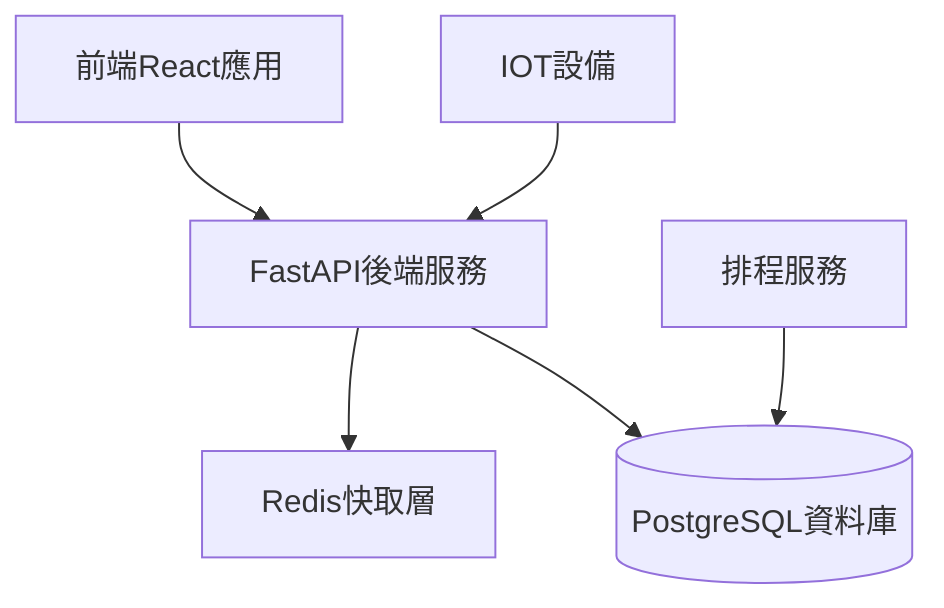
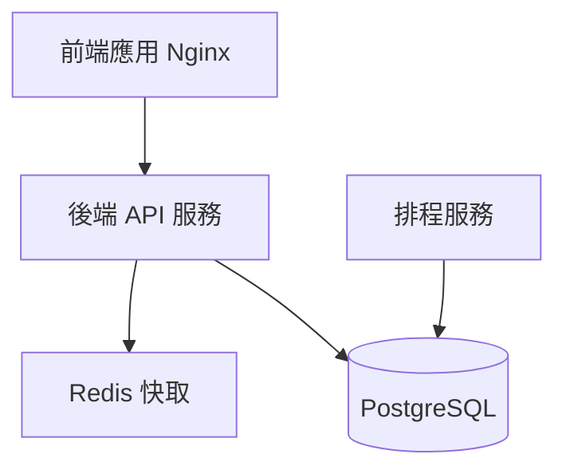

# **專案需求文件**

## **專案名稱：運動中心即時人流總覽後台系統**

## **1. 系統概述**

### **1.1 系統目標**

開發一個高效能、可擴展的後台API系統，為運動中心即時人流監控儀表板提供穩定的資料服務。採用微服務架構設計，實現前後端完全分離，提供RESTful API與WebSocket服務。

### **1.2 技術架構**

#### **1.2.1 主要技術棧**

- **後端框架**：FastAPI
- **資料庫**：PostgreSQL
- **ORM**：SQLAlchemy (異步版本)
- **API文檔**：OpenAPI (Swagger UI)
- **快取系統**：Redis
- **部署容器**：Docker & Docker Compose
- **API安全**：JWT Token 認證
- **排程系統**：APScheduler

#### **1.2.2 系統架構圖**



## **2. 資料庫設計**

### **2.1 資料表結構**

#### **2.1.1 即時人流資料表 (real_time_flows)**

```sql
CREATE TABLE real_time_flows (
    id UUID PRIMARY KEY DEFAULT gen_random_uuid(),
    zip_code CHAR(3) NOT NULL, -- 使用運動中心所在郵遞區號作為索引
    area_type VARCHAR(5) NOT NULL, -- 'gym' or 'pool'
    current_count INTEGER NOT NULL,
    timestamp TIMESTAMP WITH TIME ZONE DEFAULT CURRENT_TIMESTAMP,
    CHECK (area_type IN ('gym', 'pool'))
);

CREATE INDEX idx_real_time_flows_zip_timestamp
ON real_time_flows(zip_code, timestamp);
```

#### **2.1.2 歷史統計資料表 (historical_stats)**

```sql
CREATE TABLE historical_stats (
    id UUID PRIMARY KEY DEFAULT gen_random_uuid(),
    zip_code CHAR(3) NOT NULL, -- 使用運動中心所在郵遞區號作為索引
    area_type VARCHAR(5) NOT NULL, -- 'gym' 或 'pool'
    stats_type VARCHAR(10) NOT NULL, -- 'hourly', 'daily'
    avg_count FLOAT NOT NULL, -- 平均人數
    max_count INTEGER NOT NULL, -- 最大人數
    min_count INTEGER NOT NULL, -- 最小人數
    start_date TIMESTAMP NOT NULL, -- 統計開始時間
    end_date TIMESTAMP NOT NULL, -- 統計結束時間
    created_at TIMESTAMP WITH TIME ZONE DEFAULT CURRENT_TIMESTAMP,
    updated_at TIMESTAMP WITH TIME ZONE DEFAULT CURRENT_TIMESTAMP,
    UNIQUE(zip_code, area_type, stats_type, start_date),
    CHECK (area_type IN ('gym', 'pool')),
    CHECK (stats_type IN ('hourly', 'daily'))
);

-- 建立複合索引以提升查詢效能
CREATE INDEX idx_historical_stats_lookup
ON historical_stats(zip_code, area_type, stats_type, start_date);
```

### **2.3 運動中心配置**

### **2.3.1 配置文件結構**

運動中心的基本資訊、設施狀態及數據收集方式由以下兩個 YAML 文件提供：

#### **web_scrapers.yaml**

```yaml
version: "1.0"
last_updated: "2024-07-29"

global_settings:
    request_timeout: 10
    retry_attempts: 0
    retry_delay: 0

centers:
    taipei_beitou:  # 運動中心ID
        basic_info:
            name: "台北市北投運動中心"
            address: "台北市北投區石牌路一段39巷100號"
            zip_code: "112"
            website_url: "https://www.btsport.org.tw/"
        collector:
            type: "web_scraper"
            configs:
                - url: "https://www.btsport.org.tw/zh-TW/onsitenum"
                  use_playwright: false
                  xpath_selectors:
                      gym: "/html/body/div/h3[2]/span[1]/text()"
                      pool: "/html/body/div/h3[3]/span[1]/text()"
        facility_info:
            gym:
                available: true
                max_capacity: 60
            pool:
                available: true
                max_capacity: 200
        status: true
```

#### **api_clients.yaml**

```yaml
version: "1.0"
last_updated: "2024-07-29"

global_settings:
    request_timeout: 5
    retry_attempts: 0
    retry_delay: 0

centers:
    taipei_neihu:  # 運動中心ID
        basic_info:
            name: "台北市內湖運動中心"
            address: "台北市內湖區洲子街12號"
            zip_code: "114"
            website_url: "https://nhsc.cyc.org.tw/"
        collector:
            type: "api_client"
            configs:
                - endpoint: "https://nhsc.cyc.org.tw/api"
                  method: "POST"
                  response_format: "json"
                  mapping_path:
                      gym: "gym.0"
                      pool: "swim.0"
        facility_info:
            gym:
                available: true
                max_capacity: 130
            pool:
                available: true
                max_capacity: 200
        status: true
```

### **2.3.2 配置用途**

- **web_scrapers.yaml**：定義使用網頁爬蟲收集數據的運動中心
- **api_clients.yaml**：定義使用 API 客戶端收集數據的運動中心
- **global_settings**：提供全域的請求超時、重試次數及延遲設定
- **centers**：包含每個運動中心的基本資訊、設施狀態及數據收集方式
  - **basic_info**：運動中心基本資訊，包含名稱、地址、郵遞區號和網址
  - **collector**：數據收集器設定
  - **facility_info**：設施資訊，包含健身房和游泳池的可用性及容量
  - **status**：運動中心是否啟用

## **3. API設計**

### **3.1 RESTful API端點**

#### **3.1.1 運動中心管理**

```javascript
// 獲取所有運動中心列表
GET /api/v1/centers
Response: [
    {
        "name": string,
        "zip_code": string,
        "address": string,
        "website_url": string,
        "facility_info": {
            "gym": {
                "available": boolean,
                "max_capacity": number | null
            },
            "pool": {
                "available": boolean,
                "max_capacity": number | null
            }
        },
        "status": boolean
    }
]

// 獲取特定運動中心詳情
GET /api/v1/centers/{zip_code}
Response: {
    "name": string,
    "zip_code": string,
    "address": string,
    "website_url": string,
    "facility_info": {
        "gym": {
            "available": boolean,
            "max_capacity": number | null
        },
        "pool": {
            "available": boolean,
            "max_capacity": number | null
        }
    }
}
```

#### **3.1.2 即時人流數據**

```javascript
// 獲取即時人流數據
GET /api/v1/current_flows
Query Parameters: {
    zip_code: string  // 必須提供
}
Response: {
    "timestamp": string,
    "centers": [{
        "zip_code": string,
        "name": string,
        "gym": {
            "current_count": number,
            "max_capacity": number | null,
            "last_updated": string
        },
        "pool": {
            "current_count": number,
            "max_capacity": number | null,
            "last_updated": string
        }
    }]
}
```

#### **3.1.3 統計數據**

```javascript
// 獲取趨勢數據
GET /api/v1/trend_stats
Query Parameters: {
    zip_code: string,
    area_type: "gym" | "pool",
    time_range: "daily" | "weekly" | "monthly"
}
Response: {
    "zip_code": string,
    "area_type": string,
    "stats_type": string,
    "stats": [{
        "date_time": string,
        "avg_count": number,
        "max_count": number,
        "min_count": number
    }]
}
```

### **3.2 WebSocket API**

```typescript
// 即時更新WebSocket
WS /ws/current_flows/{center_id}
Message Format: {
    type: "update",
    data: {
        center_id: string,
        timestamp: string,
        gym: number,
        pool: number
    }
}
```

### **3.3 錯誤處理與回應格式**

- 全域統一錯誤結構
  - HTTP 狀態碼 (status)
  - 錯誤代碼 (code)
  - 可讀訊息 (message)
  - 例外詳細 (details, optional)
- 示例：

  ```json
  {
    "status": 400,
    "code": "InvalidParameter",
    "message": "area_type 必須為 'gym' 或 'pool'",
    "details": { "field": "area_type" }
  }
  ```

### **3.4 身份驗證與授權**

- 使用 JWT Bearer Token
- 登入端點：
  - POST /api/v1/auth/login
  - Request: `{ "username": string, "password": string }`
  - Response: `{ "access_token": string, "expires_in": number }`
- 受保護資源需在 Header `Authorization: Bearer <token>`

### **3.5 健康檢查與服務狀態**

- GET /health
  - Response: `{ "status": "ok", "database": "connected", "cache": "ok" }`
- 用於容器編排健康檢查

### **3.6 請求驗證與輸入模型**

- 使用 Pydantic Schema 驗證所有輸入
- 詳細定義 DTO/Model 確保資料一致性
- 自動生成 OpenAPI 文件

## **4. 系統功能實現**

### **4.1 收集器設計**

系統實作了兩種收集器以適應不同運動中心的資料來源：

1. **WebScraperCollector**：使用網頁爬蟲技術獲取資料
   - 支援 XPath 選擇器
   - 可選擇使用 Playwright 處理需要 JavaScript 渲染的頁面
   - 處理特定網站結構

2. **ApiCollector**：通過 API 獲取資料
   - 支援不同 HTTP 方法（GET、POST）
   - 靈活的資料映射機制
   - 處理多種回應格式

### **4.2 排程系統**

系統使用 APScheduler 實作兩類排程任務：

1. **FlowTask**：每 5 分鐘收集一次即時人流資料
   - 只在營業時間（8-19點）執行
   - 從配置檔案讀取運動中心資訊
   - 使用適當的收集器收集資料

2. **TrendTask**：統計資料處理
   - 每小時執行一次小時統計（9-20點）
   - 每天凌晨 1 點執行日統計
   - 計算平均、最大、最小人流值

### **4.3 資料聚合與統計**

- 使用 SQLAlchemy 的異步功能進行資料查詢與彙整
- 提供多種時間範圍的統計分析（日、週、月）
- 資料以 DTO 格式標準化輸出

## **5. 部署架構**

### **5.1 系統部署架構**



### **5.2 Docker配置**

```yaml
version: '3.8'

services:
  api:
    build:
      context: .
      dockerfile: Dockerfile
    environment:
      - DATABASE_URL=postgresql+asyncpg://user:password@db:5432/cscflow
      - REDIS_URL=redis://redis:6379
      - JWT_SECRET=your-secret-key
      - ADMIN_USERNAME=admin
      - ADMIN_PASSWORD=admin
    ports:
      - "8000:8000"
    depends_on:
      - db
      - redis

  scheduler:
    build:
      context: .
      dockerfile: Dockerfile.scheduler
    environment:
      - DATABASE_URL=postgresql+asyncpg://user:password@db:5432/cscflow
    depends_on:
      - db

  db:
    image: postgres:15-alpine
    environment:
      - POSTGRES_USER=user
      - POSTGRES_PASSWORD=password
      - POSTGRES_DB=cscflow
    volumes:
      - postgres_data:/var/lib/postgresql/data

  redis:
    image: redis:7-alpine
    volumes:
      - redis_data:/data

volumes:
  postgres_data:
  redis_data:
```

## **6. 安全性考量**

- 使用環境變數管理敏感資訊
- JWT Token 認證保護 API 端點
- 資料驗證確保輸入安全性
- 錯誤訊息標準化以避免資訊洩露
